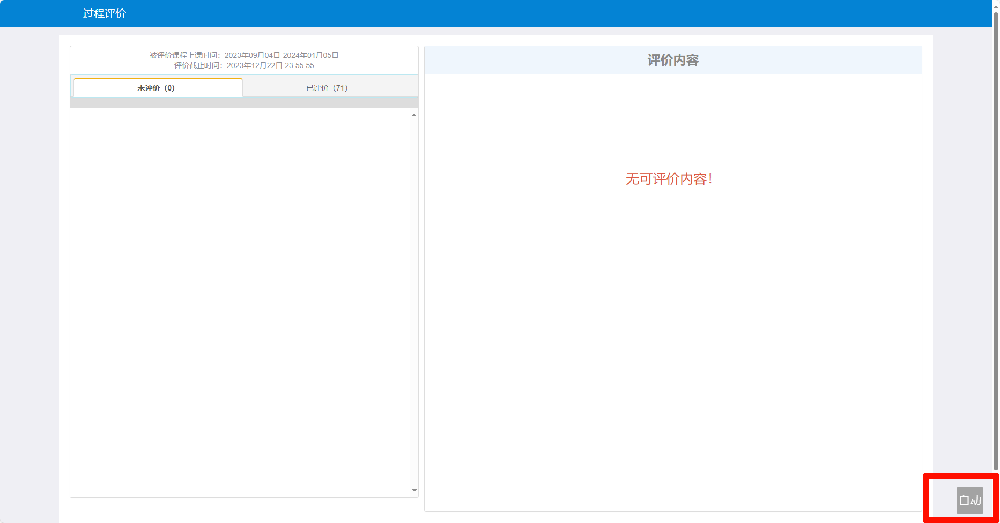

# ZCMU学评教

一款能够自动化进行ZCMU的学评教评价脚本。
> 程序仅供交流学习，请勿用作非法用途，一经发现将追究法律责任。

## Preface

之前开发了一个python的学评教脚本，但是只能运行在自己的电脑上面，导致了同学只能在我的电脑上面登录才能评价。于是花了一点时间做了这个油猴脚本。考虑到其他同学有相似的需求，因此将其开源。

## Features

- 支持一键自动评价
- 支持自定义一键评价的内容
- 支持跳过单一老师的自动评价

## Applicable

脚本适用于**浙江中医药大学学教一体华服务系统**，其他学校的不支持。

## Usage

1. 安装油猴插件
2. (如果已经有油猴就跳过这一步)点击[这里](https://greasyfork.org/zh-CN/scripts/427391-xcmu%E5%AD%A6%E8%AF%84%E6%95%99)安装脚本
3. 登录学教一体化服务系统并进入过程评价
4. 点击第一个你需要评价的老师，程序将会以这个为模板，对老师进行自动评价
5. 点击右下角自动
6. 根据提示完成所有老师的评价，注意，评价不是默认好评，而是以第一次为模板进行评价。

## 一些废话

> 1. 程序设计思路基本上为了图方便还是延续了写python时设计的思路
> 2. 偷了个懒，没有去深入研究学校学评教的逻辑，所以取巧直接记录并修改第一次人工提交的信息，然后再提交后面的内容，其实最好的方法还是去研究一下获取评价内容的页面，得到要评价的内容和格式信息，感兴趣的同学可以自己阅读一下学评教页面的源码，并不难。（提示： 每一个老师的评价都是发get请求去获取评价页面然后渲染出来的。直接抓这个页面就可以看了）
> 3. 如果有需求未来可能会进行更新。包括但不限于，一键好评，自定义设置评价信息，设置一键好评内容等等。